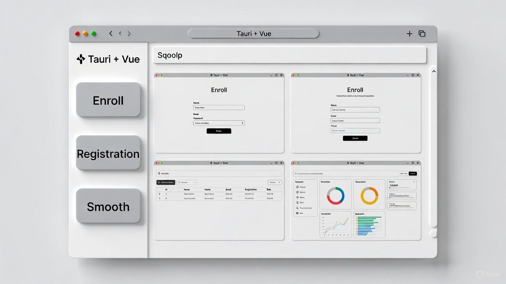

# RustDesk Config App by Tauri

一个基于 **Tauri + Vue 3** 开发的跨平台桌面配置工具，专为 RustDesk 用户设计，提供简洁、美观的图形化配置界面。

项目使用 Rust 作为后端（安全、高性能），Vue 3 作为前端（现代、响应式），Tauri 负责原生窗口和系统集成。最终打包体积小（约 6-12 MB），运行高效，无需庞大运行时。

## 特性

- 原生系统边框和标题栏（Windows/macOS/Linux 完美适配）
- 左侧垂直导航栏，快速切换配置页面
- 三个核心配置模块：
  - **Enroll**：ID Server、Relay Server、Key 等注册相关设置
  - **Registration**：许可证、密钥管理
  - **Smooth**：图像质量、编解码器、帧率等流畅度优化
- 轻量级、无 Electron 臃肿
- 支持后续扩展：读写 RustDesk 配置文件、保存设置等

## 界面预览

以下是应用运行时的截图示例（左侧深色导航栏 + 右侧配置内容区）：

<grok-card data-id="8e3d52" data-type="image_card"></grok-card>


<grok-card data-id="41d0a6" data-type="image_card"></grok-card>


<grok-card data-id="1a28c5" data-type="image_card"></grok-card>


（实际项目截图可替换为本地 `assets/image.jpg`）

## 安装与运行

```bash
# 克隆项目
git clone https://github.com/yourusername/rustdesk-cfg-app-by-tauri.git
cd rustdesk-cfg-app-by-tauri

# 安装依赖
npm install

# 开发模式运行
npm run tauri dev

# 打包发布
npm run tauri build

```markdown

